# Week 1

## Hash function

- takes any string as input
- fixed-size output (we'll use 256 bits <- what bitcoin does)
- efficiently computable

We need hash functions that are cryptographically secure...

Security properties
  - collision-free
  - hiding
  - puzzle-friendly

### Secutity properties of hash functions

#### 1- Collision-Free

Nobody can find `x` and `y` such that `x != y` and ``H(x) != H(y)``

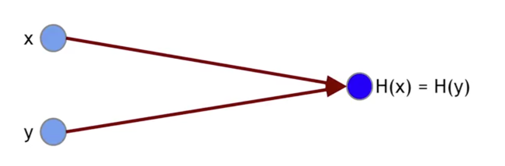

> Notice the `nobody can find` instead of `there is no` collision

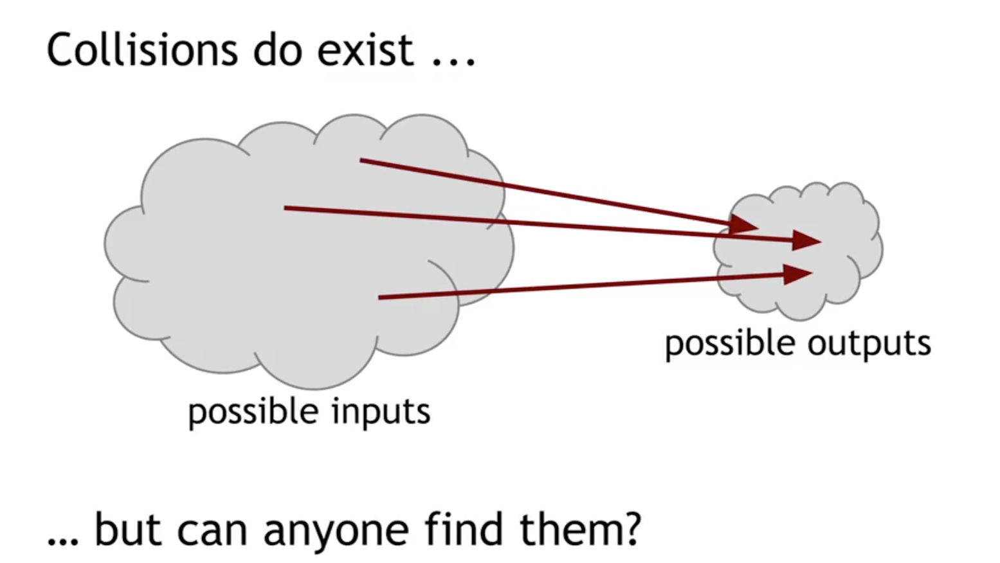

A collision can be found but it takes too long to matter (if computer since beginning universe where computing till now still infinitesimal chance...)

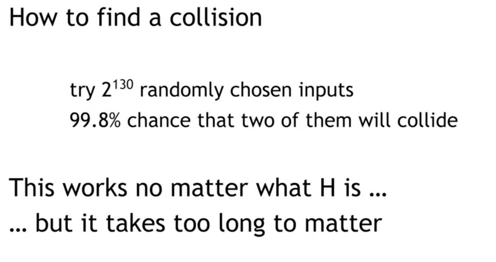

##### Application: Hash as message digest

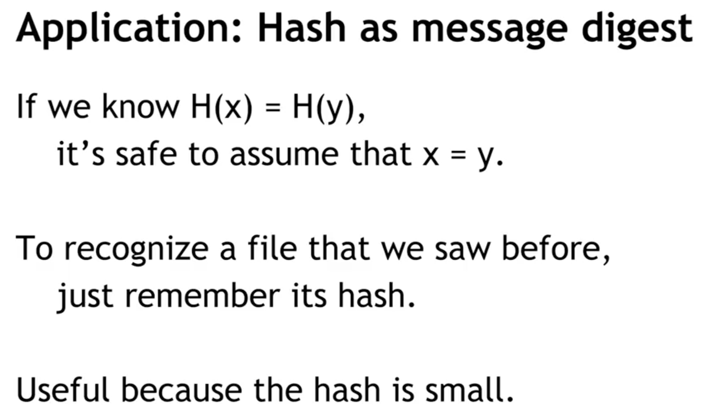

#### 2- Hiding

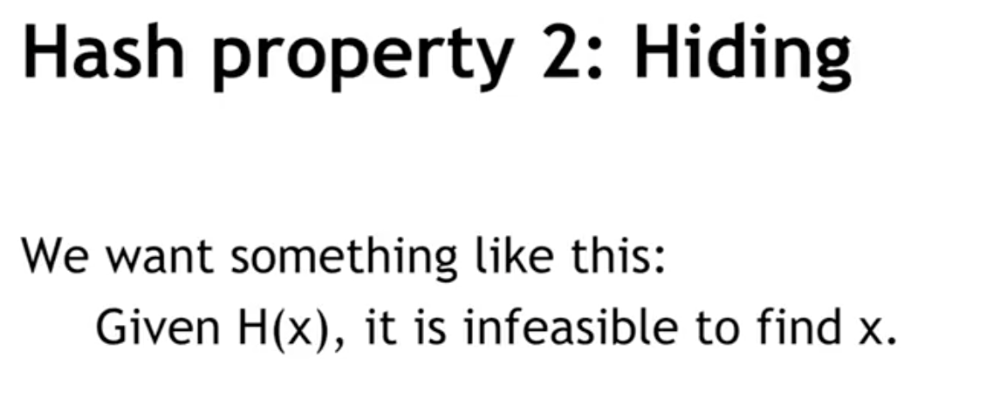
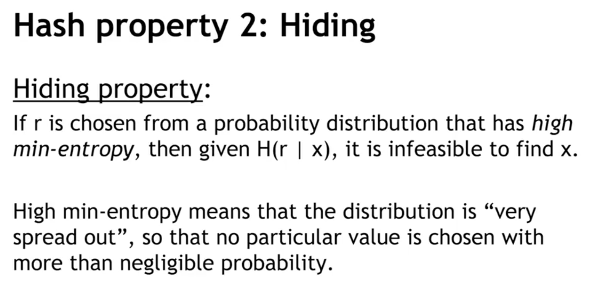

##### Application: Commitment

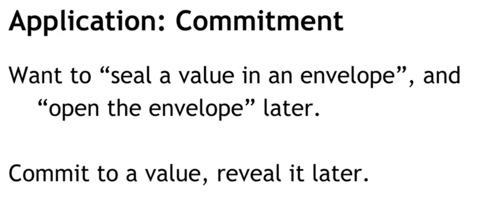
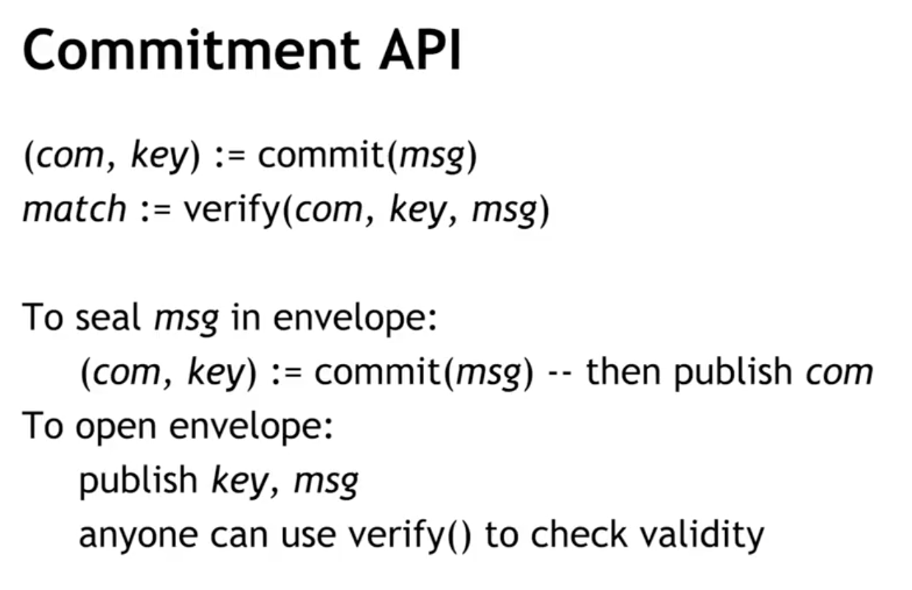

##### To seal `msg` in envelope

 we can commit a message `commit(msg)` and we will get 2 values
- commitment (envelope)
- key (secret key for unlocking the envelope)

the envelope can be published away but only those with a proper `key` will be able to check if a certain `msg` is inside of it 

##### To open envelope

we have another function to verify if a message `msg` _belongs_ to a combination commitment and key `com+key`. This will a `match` that will be either `true` or `false`

We can publish `key` & `msg` that anyone can use to check validity

##### Security Properties

- _Hiding_: Given `com`, infeasible to find `msg`
- _Binding_: Infeasible to find `msg != msg´` such that `verify(commit(msg), msg´) == true`

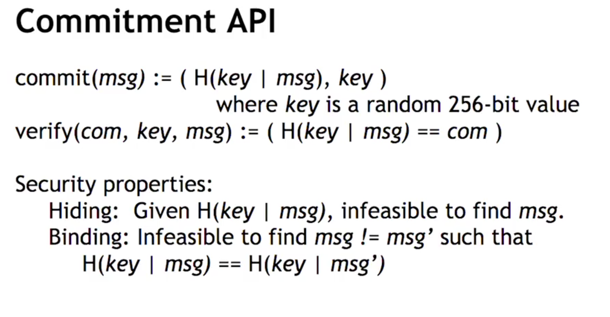

#### 3- Puzzle-friendly

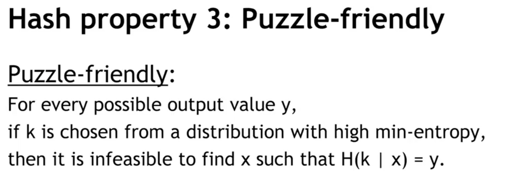

##### Application: Search Puzzle

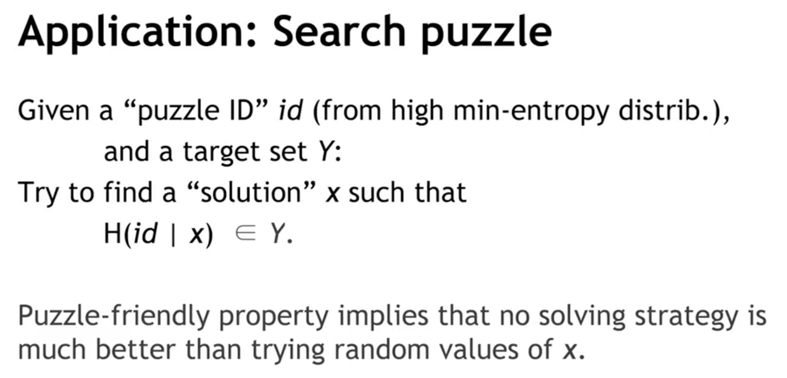

This is used for bitcoin mining!

---

The particular hash function we're going to use is the one that bitcoin uses and is called SHA-256

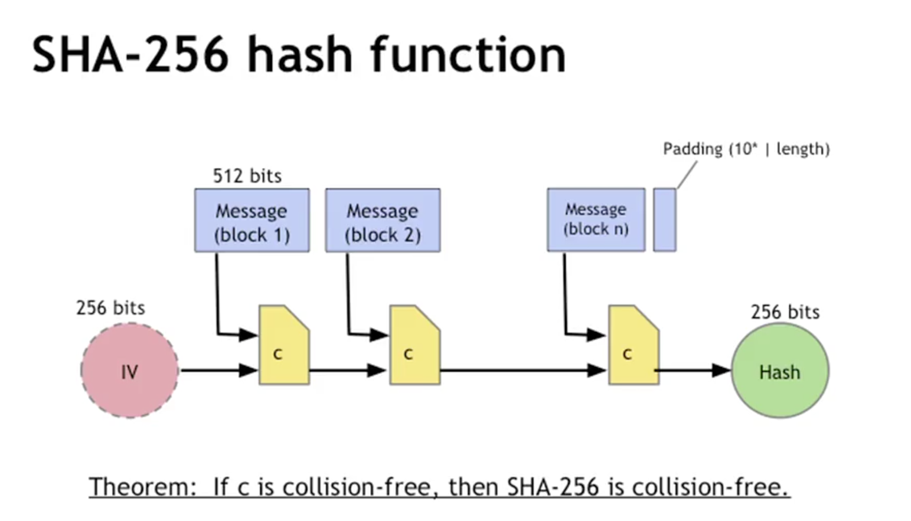

## Hash Pointers and Data Structures

A **hash pointer** is simply a pointer to where some information is stored together with a cryptographic hash of the information. _Whereas a regular pointer gives you a way to retrieve the information, a hash pointer also gives you a way to verify that the information hasn’t changed_.

​​A **hash pointer** is 
- a _pointer to where some info is stored_ 
- and _a (cryptographic) hash of the info_.

If we have a has pointer, we can:
- ask to get the info back
- and verify that it hasn't changed

> Key Idea → Build Data Structures with hash pointers

### Advantages of Merkle Trees

Tree holds many items
  but just need to remember the root hash (256 bits)
Can verify membership in O(log n) time/space

Variant: sorted Merkle tree
  can verify non-membership in O(log n)
    (show items before, after the missing one)

> More generally  → can use hash pointers in any pointer-based data structure that has no cycles

## Digital Sugnatures

What we want from signatures 

- Only you can sign, but anyone can verify
- Signature is tied to a particular document
    can't be cut-and-pasted to another doc

**API Digital Signatures**
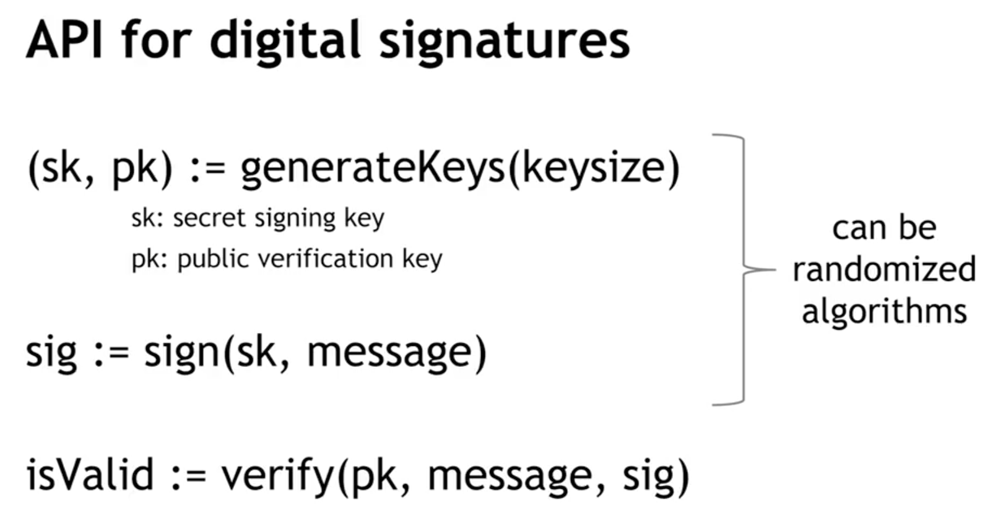

**Requirements Signatures**
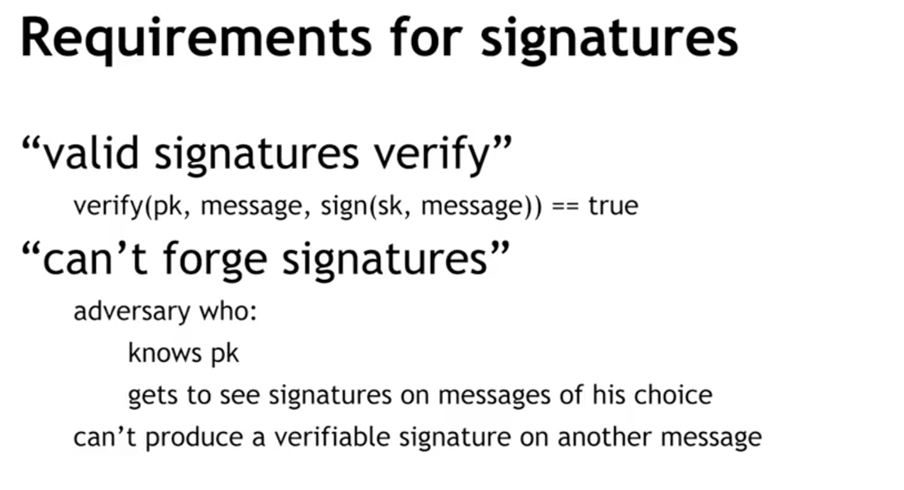

We can say that the signature scheme is unforgeable if no matter what algorithm the attacker is using, the attacker has only a negligible chance of successfully forging a message

Practical stuff:
- Algorithms are randomized
    need good source of randomness
- Limit on message size
    fix: use Hash(message) rather than message
- Fun trick: sign a hash pointer
    signature "covers" the whole structure

**Digital Signature nuts and bolts**
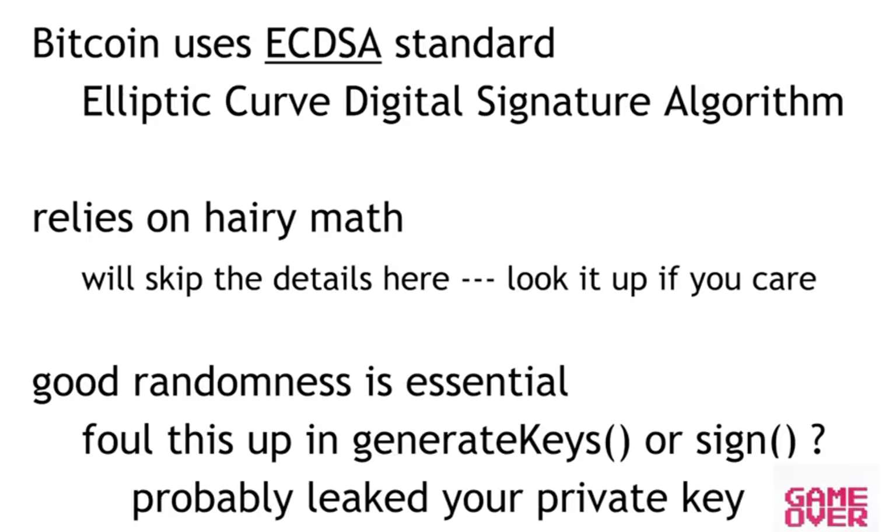

## Public keys as identities

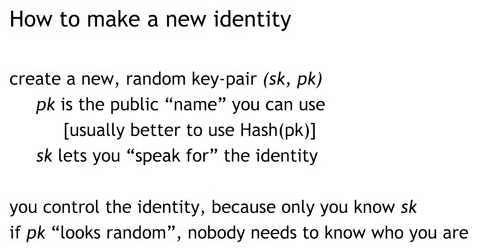

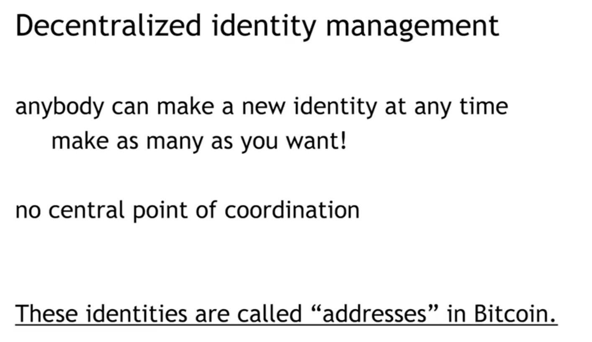

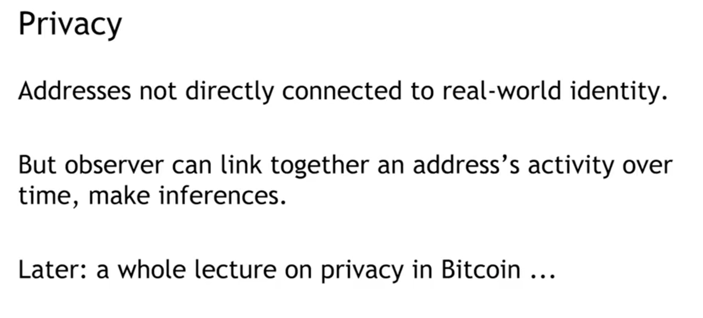

## A Simple Criptocurrency

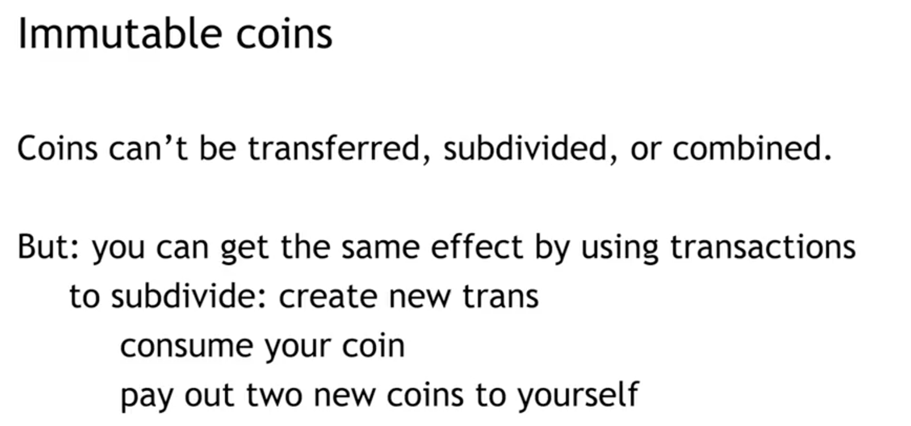